# Sistema de Alquiler de Bicicletas

Trabajo Práctico — Programación Concurrente (75.59) — Facultad de Ingeniería, UBA — Primer cuatrimestre 2026

## Integrantes

- Guido Peirano - 98187
- Tomas Goncalves Rei - 111405
- Paul Gonzalo Garcia Lopez - 112363

---

## Tabla de contenidos

1. [Descripción del problema](#1-descripción-del-problema)
2. [Arquitectura general](#2-arquitectura-general)
3. [Aplicaciones y procesos](#3-aplicaciones-y-procesos)
4. [Entidades y actores](#4-entidades-y-actores)
5. [Mensajes del sistema](#5-mensajes-del-sistema)
6. [Protocolos de comunicación](#6-protocolos-de-comunicación)
7. [Herramientas de concurrencia distribuida](#7-herramientas-de-concurrencia-distribuida)
8. [Flujos principales (casos de uso)](#8-flujos-principales-casos-de-uso)
9. [Estructura del proyecto](#9-estructura-del-proyecto)
10. [Cómo ejecutar el sistema](#10-cómo-ejecutar-el-sistema)
11. [Decisiones de diseño](#11-decisiones-de-diseño)

---

## 1. Descripción del problema

Se debe implementar un sistema distribuido para el alquiler y devolución automatizada de bicicletas en una ciudad. El sistema consta de los siguientes elementos:

- **Estaciones** distribuidas por puntos de interés, cada una con entre 10 y 20 slots que pueden albergar una bicicleta. Cuando un slot está vacío, puede detectar una bicicleta que se acerca (simulado por input), tomarla y asegurarla, liberando al usuario y cobrando un monto proporcional al tiempo de uso.
- **Bicicletas** con un identificador único que las estaciones pueden reconocer.
- **Usuarios** que mediante una aplicación móvil consultan estaciones cercanas con disponibilidad, alquilan, devuelven y pagan.
- **Pasarela de pagos** que simula al procesador externo de tarjetas de crédito, ejecutando pre-autorizaciones y cobros.

### Requerimientos transversales

- El sistema debe seguir operando aunque alguna estación pierda conectividad o el usuario no tenga señal celular.
- Se debe minimizar el tráfico de red, comunicándose preferentemente con nodos cercanos.
- Toda la implementación está hecha en Rust, sin bloques `unsafe`.
- Al menos algunas aplicaciones usan el modelo de actores (utilizando `actix`).
- Cada instancia de cada aplicación corre en un proceso independiente.

---

## 2. Arquitectura general

El sistema está compuesto por tres tipos de aplicaciones independientes que se comunican por sockets. Cada aplicación corre en un proceso del sistema operativo separado.

### 2.1 Vista de procesos y comunicación

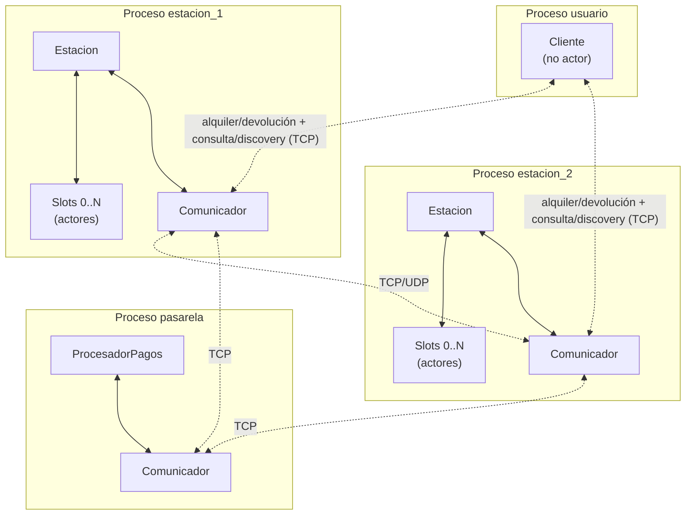

Las líneas continuas son comunicación entre actores del mismo proceso (vía `Addr`). Las líneas punteadas son comunicación entre procesos por socket.

El usuario habla **directamente con las estaciones** para todo: alquiler, devolución, consulta de disponibilidad y descubrimiento del líder. No hay ningún proceso gateway centralizado (ver la decisión de diseño en la sección 11).

### 2.2 Decisiones de alto nivel

- **Modelo de actores** en las aplicaciones `estacion` y `pasarela`, usando `actix`. La aplicación `usuario` es un cliente simple (no necesariamente con actores).
- **Comunicación entre procesos** por sockets TCP (operaciones críticas, request/response) y UDP (estado agregado periódico, no crítico).
- **Comunicación entre actores del mismo proceso** por `Addr`, en memoria, asincrónico.
- **Topología estática**: cada estación arranca con un archivo de configuración que lista los puertos y datos de todas las estaciones y la pasarela.
- **Líder dinámico** elegido entre las estaciones por algoritmo Ring. El líder mantiene un registro autoritativo de alquileres abiertos en el sistema.
- **Cada `struct` y cada tipo de actor en su propio archivo fuente**, según el requerimiento del enunciado.

---

## 3. Aplicaciones y procesos

| Aplicación | Cantidad de instancias | Modelo de actores | Rol |
|---|---|---|---|
| `estacion` | M (una por estación física) | Sí (Estacion + Slot + Comunicador) | Maneja slots, libera y asegura bicis, coordina con vecinas y con pagos, responde consultas de disponibilidad. Una de las estaciones es el líder. |
| `pasarela` | 1 | Sí (ProcesadorPagos + Comunicador) | Simula la pasarela de pagos. Maneja pre-autorizaciones y cobros. |
| `usuario` | N (una por usuario) | No | Cliente que alquila, devuelve, consulta y paga. Descubre al líder preguntando a las estaciones. |

Las tres aplicaciones se construyen como binarios independientes dentro de un mismo workspace de Cargo, compartiendo una crate de utilidades (`comun`) donde viven los tipos de mensajes serializables y las definiciones compartidas.

---

## 4. Entidades y actores

### 4.1 Aplicación `estacion`

#### 4.1.1 Actor `Estacion`

**Finalidad.** Coordina el estado agregado de la estación, gestiona los alquileres iniciados en ella, comunica con el exterior a través del `Comunicador`, y opera el algoritmo de elección de líder. Es el coordinador del 2PC para los alquileres.

**Estado interno.**

```rust
struct Estacion {
    id: EstacionId,
    ubicacion: (f64, f64),
    slots: Vec<Addr<Slot>>,
    alquileres_propios: HashMap<RentalId, Alquiler>,
    pagos_pendientes: Vec<PagoPendiente>,
    rol: RolEstacion,
    lider_conocido: EstadoLider,
    term_actual: u64,
    comunicador: Addr<Comunicador>,
    archivo_persistencia: PathBuf,
}

enum RolEstacion {
    Lider {
        registro_alquileres: HashMap<RentalId, Alquiler>,
        cache_estados: HashMap<EstacionId, EstadoEstacion>,
        eventos_procesados: HashSet<EventId>,
    },
    Follower,
}

enum EstadoLider {
    Conocido(EstacionId, SocketAddr),
    EnEleccion,
    Desconocido,
}

struct Alquiler {
    rental_id: RentalId,
    bici_id: BiciId,
    usuario_id: UsuarioId,
    estacion_origen: EstacionId,
    inicio: Timestamp,
    fin: Option<Timestamp>,
    preauth_id: Option<String>,
    estado: EstadoAlquiler,
}

enum EstadoAlquiler {
    Activo,
    Cerrado,
}
```

El campo `preauth_id` es `Option<String>`: vale `None` mientras el alquiler todavía no obtuvo una pre-autorización (caso de un alquiler iniciado sin conectividad con la pasarela, ver sección 7.1.1, Caso E). Ningún alquiler se reporta al líder con `preauth_id = None` (ver la regla de la sección 7.1.1).

> **Nota sobre el tiempo.** Usamos `Timestamp` (milisegundos desde el epoch UNIX) en lugar de `std::time::Instant`, porque `Instant` es opaco y local a cada proceso: no se puede serializar ni comparar entre máquinas, y los timestamps de alquiler viajan por la red para calcular el cobro.

**Ciclo de vida del Alquiler.**

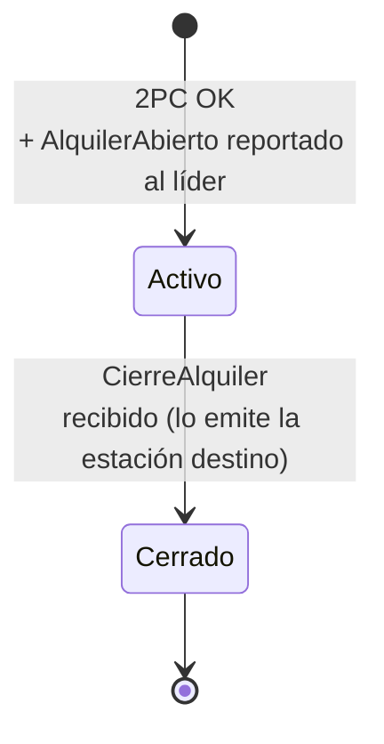

**Mensajes que recibe (selección).**

| Mensaje | Origen | Comportamiento |
|---|---|---|
| `MensajeRecibido(SolicitudAlquiler)` | Comunicador | Inicia el 2PC de alquiler con Slot + Pasarela. |
| `MensajeRecibido(SolicitudDevolucion)` | Comunicador | Acepta físicamente la bici en el Slot, notifica al líder (`NotificarDevolucion`). |
| `Voto(Yes/No)` | Slot / Pasarela | Recolecta votos durante el 2PC. |
| `MensajeRecibido(DatosParaCobro)` | Comunicador (siendo estación destino) | Cobra a la pasarela y notifica el cierre al líder y al origen. |
| `MensajeRecibido(NoRegistradoAun)` | Comunicador (siendo estación destino) | Reintenta `NotificarDevolucion` con backoff. |
| `MensajeRecibido(CierreAlquiler)` | Comunicador (siendo origen) | Marca el alquiler local como cerrado. |
| `MensajeRecibido(Election)` | Comunicador | Procesa mensaje del Ring (agrega su ID, forwardea). |
| `MensajeRecibido(Coordinator)` | Comunicador | Actualiza `lider_conocido` y `term_actual`. |
| `LiderNoResponde` | Comunicador | Inicia nueva elección. |
| `MensajeRecibido(SolicitarAlquileresAbiertos)` | Comunicador (cuando es follower) | Responde con sus alquileres propios. |

**Mensajes que envía (selección).**

| Mensaje | Destino | Cuándo |
|---|---|---|
| `Prepare*` / `Commit*` / `Abort*` | Slot, Pasarela | Durante el 2PC de alquiler. |
| `EnviarAlLider(AlquilerAbierto)` | Comunicador | Tras alquiler exitoso con preauth obtenida (async). |
| `EnviarAlLider(NotificarDevolucion)` | Comunicador | Tras recibir una bici en devolución. |
| `EnviarConfiable(ProcesarCobro)` | Comunicador → Pasarela | Siendo destino, tras recibir `DatosParaCobro`. |
| `EnviarAlLider(DevolucionProcesada)` + `EnviarConfiable(CierreAlquiler)` | Comunicador | Siendo destino, tras cobrar: avisa al líder y directo al origen. |
| `PropagarEstado` | Comunicador | Periódicamente (UDP, snapshot de estado al líder). |
| `EnviarRingMessage` | Comunicador | Durante elecciones. |

#### 4.1.2 Actor `Slot`

**Finalidad.** Representa una posición física donde puede haber o no una bicicleta. Es la unidad atómica que asegura bicis que llegan y libera bicis a usuarios autorizados. Participa como uno de los participantes del 2PC de alquiler.

**Estado interno.**

```rust
struct Slot {
    id: u32,
    bici: Option<BiciId>,
    reservado_para: Option<TransaccionId>,
}
```

**Mensajes que recibe.**

| Mensaje | Origen | Comportamiento |
|---|---|---|
| `PrepareLiberacion { tx_id }` | Estacion | Si tiene bici y no está reservado, marca `reservado_para = Some(tx_id)`, responde `Voto(Yes)`. |
| `CommitLiberacion { tx_id }` | Estacion | Libera la bici (limpia `bici` y `reservado_para`), responde `BiciLiberada`. |
| `AbortLiberacion { tx_id }` | Estacion | Limpia `reservado_para` (no toca la bici). |
| `AceptarBici { bici_id }` | Estacion | Si está vacío, asegura la bici (`bici = Some(bici_id)`), responde `BiciAsegurada`. |
| `ConsultarEstado` | Estacion | Responde `EstadoSlot { ocupado, bici_id }`. |

**Mensajes que envía.**

A `Estacion`: `Voto(Yes/No)`, `BiciLiberada`, `BiciAsegurada`, `EstadoSlot`.

#### 4.1.3 Actor `Comunicador`

**Finalidad.** Aísla la lógica de red. Mantiene los sockets TCP y UDP, gestiona la conexión con vecinas y con el líder, encola mensajes diferidos durante períodos sin conectividad o sin líder conocido, y lleva el registro de qué servicios alcanza en este momento.

> El `Comunicador` es un actor **compartido** (vive en la crate `comun`), porque tanto la estación como la pasarela necesitan el mismo manejo de sockets con framing. Reenvía cada payload recibido al actor de negocio (vía un `Recipient`), que lo deserializa. Los campos específicos de la estación (`cola_para_lider`, `ServiciosAlcanzables`) que se describen abajo se incorporan en las etapas de tolerancia a fallas y modo desconectado.

**Estado interno.**

```rust
struct Comunicador {
    estacion_id: EstacionId,
    estacion_addr: Addr<Estacion>,
    socket_tcp: TcpListener,
    socket_udp: UdpSocket,
    conexiones_tcp: HashMap<EstacionId, TcpStream>,
    vecinas: HashMap<EstacionId, SocketAddr>,
    pasarela_addr: SocketAddr,
    servicios: ServiciosAlcanzables,
    cola_para_lider: VecDeque<MensajeAlLider>,
}

/// Qué servicios alcanza la estación en este momento. Se actualiza según el
/// resultado de los intentos de conexión (éxito / timeout). Permite distinguir,
/// por ejemplo, llegar a la pasarela pero no al líder, o viceversa.
struct ServiciosAlcanzables {
    pasarela: bool,
    lider: bool,
}

struct MensajeAlLider {
    event_id: EventId,
    payload: PayloadSerializado,
    intentos: u32,
}
```

A diferencia del usuario, la estación **no** tiene un estado global "conectada / desconectada": o alcanza un servicio o no, y eso puede variar servicio por servicio. La `Estacion` no consulta un flag global: intenta enviar a través del `Comunicador` y reacciona al resultado (voto recibido vs. timeout).

**Mensajes que recibe (selección).**

| Mensaje | Origen | Comportamiento |
|---|---|---|
| `EnviarConfiable { destino, payload }` | Estacion | Envía por TCP. Si falla, reintenta o encola según el destino. |
| `EnviarGossip { destino, payload }` | Estacion | Envía por UDP, fire and forget. |
| `EnviarAlLider { payload }` | Estacion | Si conoce al líder, lo envía. Si no, encola. |
| `MensajeRecibidoDeRed { origen, payload }` | Tasks de escucha | Reenvía al actor `Estacion`. |
| `NuevoLider { id, term }` | Estacion (tras Coordinator) | Actualiza dirección del líder, dispara `FlushCola`. |
| `FlushCola` | self | Reenvía mensajes pendientes al líder actual. |

### 4.2 Aplicación `pasarela`

#### 4.2.1 Actor `ProcesadorPagos`

**Finalidad.** Simula la pasarela bancaria. Maneja pre-autorizaciones (reserva un monto en la tarjeta) y cobros definitivos. Calcula el monto a cobrar a partir de los timestamps `t0` y `t1` y una tarifa configurable. Persiste el estado en un archivo JSON para sobrevivir reinicios. Garantiza idempotencia sobre el `preauth_id`.

**Estado interno.**

```rust
struct ProcesadorPagos {
    pre_autorizaciones: HashMap<String, PreAutorizacion>,
    cobros_realizados: Vec<Cobro>,
    tarifa: TarifaConfig,
    archivo_persistencia: PathBuf,
}

struct PreAutorizacion {
    id: String,
    usuario_id: UsuarioId,
    tarjeta: DatosTarjeta,
    monto_reservado: f64,
    estacion_solicitante: EstacionId,
    timestamp: Timestamp,
    estado: EstadoPreAuth,
    tx_id: Option<TransaccionId>,
}

enum EstadoPreAuth {
    Preparada,
    Activa,
    Cobrada { monto_final: f64 },
    CobroFallido { motivo: String },
    Anulada,
}

struct TarifaConfig {
    base: f64,
    por_minuto: f64,
}
```

El estado `CobroFallido` cubre el caso en que un cobro no pueda completarse por fondos insuficientes (por ejemplo, el cobro diferido de un alquiler iniciado offline). Vive únicamente en la pasarela: las estaciones y el líder no llevan registro del resultado del cobro.

**Mensajes que recibe.**

| Mensaje | Origen | Comportamiento |
|---|---|---|
| `PreparePreauth { tx_id, tarjeta, monto_propuesto }` | Estacion (TCP) | Valida tarjeta, reserva fondos, crea preauth en estado `Preparada`. Responde `Voto(Yes/No)`. |
| `CommitPreauth { tx_id, preauth_id }` | Estacion (TCP) | Marca preauth como `Activa`. Responde `PreauthConfirmada`. |
| `AbortPreauth { tx_id, preauth_id }` | Estacion (TCP) | Libera fondos reservados, marca `Anulada`. |
| `ProcesarCobro { preauth_id, t0, t1 }` | Estación destino (TCP) | Calcula `monto = tarifa.base + tarifa.por_minuto * (t1 - t0)`. Cobra. Marca `Cobrada`. Responde con el monto. Idempotente: si ya estaba `Cobrada`, devuelve el monto previo. Si no hay fondos, marca `CobroFallido`. |

La pasarela **ya no recibe mensajes del líder**: el cobro lo dispara la estación que recibe la bici en la devolución (ver sección 8.2).

#### 4.2.2 Actor `Comunicador` (pasarela)

Análogo al `Comunicador` de la estación, pero más simple. Mantiene un socket TCP en escucha. No participa de elecciones ni de Ring.

### 4.3 Aplicación `usuario`

**Finalidad.** Cliente que el usuario opera por consola. Mantiene su estado de alquiler (con o sin bici) y su estado de conectividad, descubre al líder preguntando a las estaciones, envía solicitudes a las estaciones, recibe confirmaciones.

**Estado interno.**

```rust
struct Usuario {
    id: UsuarioId,
    ubicacion: (f64, f64),
    tarjeta: DatosTarjeta,
    estado: EstadoUsuario,
    conectividad: EstadoConectividadUsuario,
    lider_conocido: Option<(EstacionId, SocketAddr, u64)>, // id, addr, term
    estaciones_conocidas: HashMap<EstacionId, (SocketAddr, (f64, f64))>,
}

enum EstadoUsuario {
    SinBici,
    ConBici {
        bici_id: BiciId,
        rental_id: RentalId,
    },
}

enum EstadoConectividadUsuario {
    Global,    // puede alcanzar al líder para consultas de disponibilidad
    SoloLocal, // solo puede conectarse a estaciones físicamente cercanas
}
```

Modelar el estado como `enum` evita estados inválidos por construcción. El `term` en `lider_conocido` permite descartar respuestas de discovery más viejas. El estado `SoloLocal` es propio del usuario (es móvil y puede quedarse sin señal celular): puede alquilar y devolver contra una estación cercana, pero no consultar disponibilidad global (eso requiere al líder).

---

## 5. Mensajes del sistema

Esta sección consolida los mensajes que viajan por la red. Los mensajes internos entre actores del mismo proceso (vía `Addr`) están descritos en la sección de cada actor.

> Como se mencionó, todos los timestamps que viajan por la red usan `Timestamp` (millis desde el epoch), no `Instant`.

### 5.1 Usuario ↔ Estación (TCP)

El usuario manda dos familias de mensajes a la misma estación por el mismo endpoint TCP: **operaciones** (alquiler/devolución) y **consultas** (discovery del líder y disponibilidad). Para distinguirlas, ambas viajan envueltas en un enum sobre:

```rust
enum MensajeUsuario {
    Operacion(MensajeUsuarioAEstacion),
    Consulta(MensajeUsuarioAEstacionConsulta),
}
```

**Operaciones:**

```rust
enum MensajeUsuarioAEstacion {
    SolicitudAlquiler {
        usuario_id: UsuarioId,
        slot_id: u32,
        tarjeta: DatosTarjeta,
    },
    SolicitudDevolucion {
        usuario_id: UsuarioId,
        bici_id: BiciId,
        rental_id: RentalId,
        slot_id: u32,
    },
}

enum MensajeEstacionAUsuario {
    AlquilerConfirmado {
        rental_id: RentalId,
        bici_id: BiciId,
        preauth_id: String,
    },
    AlquilerRechazado {
        motivo: String,
    },
    DevolucionAceptada {
        bici_id: BiciId,
    },
    DevolucionRechazada {
        motivo: String,
    },
    DevolucionCompletada {
        rental_id: RentalId,
        monto_cobrado: f64,
        tiempo_uso_minutos: u32,
    },
}
```

**Consultas (discovery del líder y disponibilidad):**

```rust
enum MensajeUsuarioAEstacionConsulta {
    PreguntarLider,
    ConsultaDisponibilidad {
        usuario_id: UsuarioId,
        ubicacion: (f64, f64),
        radio_max_km: f64,
    },
}

enum MensajeEstacionAUsuarioConsulta {
    RespuestaLider {
        lider_id: EstacionId,
        lider_addr: SocketAddr,
        term: u64,
    },
    EnEleccion,
    LiderDesconocido,
    RespuestaDisponibilidad {
        estaciones: Vec<InfoEstacion>,
    },
}

struct InfoEstacion {
    estacion_id: EstacionId,
    ubicacion: (f64, f64),
    bicis_disponibles: u32,
    slots_libres: u32,
    last_seen: Timestamp,
}
```

`EnEleccion` y `LiderDesconocido` se distinguen a propósito: la primera indica que la estación está participando activamente de un Ring en curso; la segunda, que es un follower que todavía no recibió un `Coordinator`. El usuario las trata igual (reintenta con backoff), pero la distinción es útil para logging y diagnóstico.

### 5.2 Estación ↔ Estación (TCP para crítico, UDP para periódico)

```rust
enum MensajeEntreEstacionesTCP {
    // Eventos al líder
    AlquilerAbierto {
        event_id: EventId,
        rental_id: RentalId,
        bici_id: BiciId,
        usuario_id: UsuarioId,
        estacion_origen: EstacionId,
        t0: Timestamp,
        preauth_id: String,
    },
    NotificarDevolucion {
        event_id: EventId,
        bici_id: BiciId,
        estacion_destino: EstacionId,
        t1: Timestamp,
    },
    // Líder → Estación destino: datos del alquiler para que la estación destino
    // cobre directamente. Incluye estacion_origen para que pueda notificarle el cierre.
    DatosParaCobro {
        event_id: EventId,
        rental_id: RentalId,
        preauth_id: String,
        t0: Timestamp,
        estacion_origen: EstacionId,
    },
    // Líder → Estación destino: el líder todavía no tiene registrado el alquiler
    // de esa bici (el reporte del origen no llegó, o el origen sigue offline).
    NoRegistradoAun {
        event_id: EventId,
    },
    DevolucionProcesada {
        event_id: EventId,
        rental_id: RentalId,
        monto_cobrado: f64,
        tiempo_uso_minutos: u32,
    },
    // Lo emite la estación destino hacia la estación de origen (no el líder).
    CierreAlquiler {
        rental_id: RentalId,
        t1: Timestamp,
        monto_cobrado: f64,
    },
    EventoProcesadoAck { event_id: EventId },

    // Reconstrucción de registro
    SolicitarAlquileresAbiertos { term: u64 },
    RespuestaAlquileres { alquileres: Vec<Alquiler> },
    IngresoTardio { alquileres: Vec<Alquiler> },

    // Manejo de bicis huérfanas
    BuscarAlquilerPropio { event_id: EventId, bici_id: BiciId },
    AlquilerEncontrado { event_id: EventId, alquiler: Alquiler },
    NoLoTengo { event_id: EventId, bici_id: BiciId },
    AlquilerNoEncontrado { bici_id: BiciId },
    ReprocesarDevolucion { bici_id: BiciId },
    BiciHuerfanaConfirmada { bici_id: BiciId },

    // Ring de elección
    Election { ids: Vec<EstacionId>, iniciador: EstacionId },
    Coordinator { lider: EstacionId, term: u64 },
}

enum MensajeEntreEstacionesUDP {
    EstadoEstacion {
        estacion_id: EstacionId,
        ubicacion: (f64, f64),
        bicis_disponibles: u32,
        slots_libres: u32,
        timestamp: Timestamp,
    },
}
```

### 5.3 Estación ↔ Pasarela (TCP)

```rust
enum MensajeEstacionAPasarela {
    PreparePreauth {
        tx_id: TransaccionId,
        usuario_id: UsuarioId,
        tarjeta: DatosTarjeta,
        monto_propuesto: f64,
    },
    CommitPreauth {
        tx_id: TransaccionId,
        preauth_id: String,
    },
    AbortPreauth {
        tx_id: TransaccionId,
        preauth_id: String,
    },
    ProcesarCobro {
        preauth_id: String,
        t0: Timestamp,
        t1: Timestamp,
    },
}

enum MensajePasarelaAEstacion {
    Voto { tx_id: TransaccionId, resultado: VotoResultado, preauth_id: Option<String> },
    PreauthConfirmada { preauth_id: String },
    PreauthAnulada { preauth_id: String },
    CobroConfirmado { preauth_id: String, monto: f64 },
    CobroRechazado { preauth_id: String, motivo: String },
}

enum VotoResultado {
    Yes,
    No { motivo: String },
}
```

---

## 6. Protocolos de comunicación

| Enlace | Protocolo | Justificación |
|---|---|---|
| Usuario ↔ Estación (alquiler, devolución) | TCP | Operaciones críticas, request/response. |
| Usuario ↔ Estación (consulta disponibilidad, discovery del líder) | TCP | Request/response, requiere confiabilidad. |
| Estación ↔ Pasarela | TCP | Involucra dinero; debe garantizar entrega y orden. |
| Estación → Líder (eventos de alquiler) | TCP | Crítico: perder un evento equivale a perder un cobro. |
| Estación ↔ Estación (Ring de elección) | TCP | Protocolo secuencial, requiere orden y entrega. |
| Estación → Líder (estado agregado periódico) | UDP | Frecuente, pérdidas individuales son tolerables (el siguiente snapshot compensa). |

### Justificación de la elección TCP/UDP

**TCP** se usa donde la pérdida de un mensaje genera inconsistencia o pérdida de dinero, donde el orden importa, y donde se necesita confirmación de recepción. La sobrecarga del handshake es aceptable para volúmenes bajos.

**UDP** se usa para el único caso donde los mensajes son frecuentes y la pérdida no es problemática: las actualizaciones de estado agregado de cada estación al líder. Estas se envían cada ~3 segundos por estación; si se pierde uno, el siguiente actualiza la cache del líder con info más fresca.

---

## 7. Herramientas de concurrencia distribuida

El sistema utiliza dos herramientas de concurrencia distribuida vistas en la cátedra, según el requerimiento del enunciado.

### 7.1 Two-Phase Commit (2PC) — Alquiler de bicicleta

**Aplicación:** garantiza la atomicidad del proceso de alquiler entre los tres participantes involucrados.

**Roles:**

- **Coordinador:** Actor `Estacion` (la estación donde el usuario inicia el alquiler).
- **Participantes:**
  - Actor `Slot` (local, el slot específico que liberará la bici).
  - Actor `ProcesadorPagos` (remoto, en proceso `pasarela`).

**Fases:**

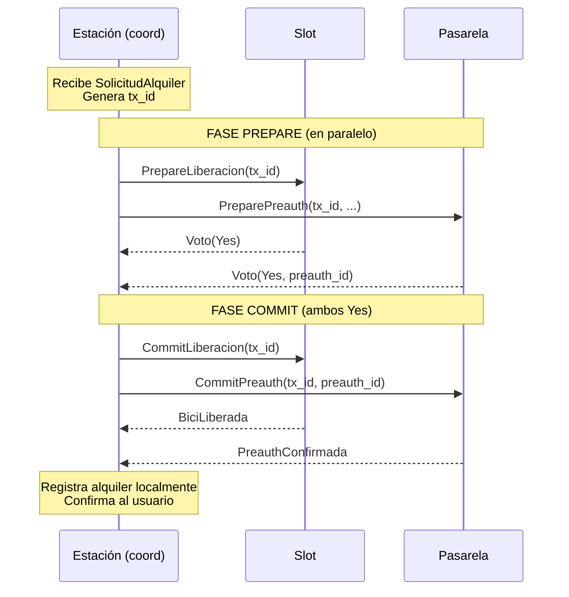

**Si alguno vota No** (slot vacío, tarjeta inválida, etc.) → el coordinador envía `Abort` a ambos participantes. El slot libera la reserva, la pasarela libera fondos reservados. El usuario recibe `AlquilerRechazado`.

**Garantías:** o las dos acciones ocurren (slot libera bici + pasarela retiene fondos) o ninguna. No quedan estados intermedios donde se cobró sin entregar bici, o viceversa.

#### 7.1.1 Manejo de fallas del 2PC

El 2PC clásico tiene puntos de falla conocidos que debemos manejar explícitamente. Documentamos cada uno:

**Caso A — Participante se cae durante Prepare.**
Si un participante (Slot o Pasarela) se cae antes de votar, el coordinador no recibe el voto. Tras un timeout configurado (default: 3 segundos), el coordinador considera el voto como `No` implícito y aborta la transacción enviando `Abort` al participante sobreviviente. El usuario recibe `AlquilerRechazado` con motivo "timeout en preparación".

**Caso B — Coordinador se cae entre Prepare y Commit (caso crítico clásico).**
Es el peor caso del 2PC: los participantes ya votaron `Yes`, reservaron tentativamente sus recursos, y esperan la decisión final que nunca llega. Cada participante implementa un timeout de transacción (default: 10 segundos): si después de votar `Yes` no recibe `Commit` ni `Abort`, aborta unilateralmente y libera el recurso reservado.

- En el **Slot**, esto significa limpiar `reservado_para = None` y mantener la bici asegurada.
- En la **Pasarela**, significa liberar los fondos reservados y marcar la pre-autorización como `Anulada`.

Cuando el usuario reintente el alquiler, arranca un nuevo 2PC con un nuevo `tx_id`. No hay riesgo de doble cobro porque el `preauth_id` anterior quedó anulado.

**Caso C — Coordinador se cae durante Commit (después de que algún participante ya commiteó).**
Acá puede haber inconsistencia temporal: el Slot commiteó (liberó la bici) pero la Pasarela no llegó a commitear. Mitigación:

- Si la Pasarela timeoutea sobre el `Commit` esperado, no aborta: como ya votó `Yes`, sabe que el coordinador decidió commit (o estaba a punto de hacerlo). Espera reintentos. Cuando el coordinador vuelve, persiste sus alquileres pendientes en disco y completa el Commit que le faltaba.
- Si el coordinador no vuelve nunca (caída permanente), la pre-autorización queda en estado `Preparada` indefinidamente. El sistema la detecta como "transacción huérfana" tras un tiempo prudencial (configurable, default: 1 hora) y la marca como `Anulada`. El usuario que se llevó la bici real (porque el Slot sí commiteó) no es cobrado por este alquiler — el alquiler nunca quedó registrado en el sistema.

**Caso D — Participante recibe un mensaje duplicado.**
Si por reintentos un participante recibe dos veces el mismo `PrepareLiberacion` con el mismo `tx_id`, responde idempotentemente (misma respuesta que la primera vez, sin re-procesar). Lo mismo aplica para `Commit` y `Abort`. Cada participante mantiene un set de `tx_id` ya procesados.

**Caso E — La pasarela no es alcanzable (modo desconectado).**
Cuando el `Comunicador` reporta que la pasarela no es alcanzable (timeout de 5 segundos, configurable), la estación omite al participante `ProcesadorPagos` del 2PC y resuelve el alquiler solo con el voto del `Slot`. Al aceptarlo, la estación:

1. Registra el alquiler en `alquileres_propios` con `preauth_id = None`.
2. Persiste un `PagoPendiente` en disco.
3. Confirma el alquiler al usuario.
4. **No reporta el alquiler al líder** (por la regla de abajo: el líder nunca debe conocer un alquiler sin preauth).
5. Cuando el `Comunicador` recupera el acceso a la pasarela, procesa cada `PagoPendiente`: hace la pre-autorización; al obtenerla, completa el alquiler con el `preauth_id` real y recién entonces lo reporta al líder (`AlquilerAbierto`). **El cobro no ocurre acá**: sucede cuando la bici se devuelve, por el flujo normal de CU2.

```rust
/// Alquiler completado localmente sin pasar por la pasarela.
/// Se persiste en disco y se procesa cuando se restaura el acceso a la pasarela.
struct PagoPendiente {
    rental_id: RentalId,
    bici_id: BiciId,
    usuario_id: UsuarioId,
    tarjeta: DatosTarjeta,
    t0: Timestamp,
}
```

**Regla clave: ningún alquiler se reporta al líder sin pre-autorización.** En el caso normal esto se cumple solo, porque el 2PC incluye la pre-autorización antes de confirmar el alquiler. En modo offline, el reporte al líder se **difiere** hasta haber obtenido la preauth. Como consecuencia, el registro del líder solo contiene alquileres con `preauth_id` válido, y por eso el `preauth_id` que el líder entrega en `DatosParaCobro` puede ser `String` (nunca `None`).

**Nota de consistencia.** En modo offline se relaja deliberadamente la atomicidad estricta del 2PC: la bici puede entregarse antes de que exista una pre-autorización confirmada. Es una decisión consciente que prioriza la disponibilidad (que el usuario pueda sacar la bici aunque la estación no alcance al banco) por sobre la atomicidad. Si la pre-autorización diferida fracasa (p. ej. tarjeta sin fondos), la pasarela marca el cobro como `CobroFallido`; ese estado es dominio de la pasarela, no de la estación.

**Timeouts configurables:**

| Timeout | Valor default | Configurable |
|---|---|---|
| Prepare → Voto | 3 segundos | Si |
| Voto Yes → Commit/Abort | 10 segundos | Si |
| Detección de transacción huérfana | 1 hora | Si |
| Intento de conexión a pasarela (antes de resolver el alquiler solo con el Slot) | 5 segundos | Si |

**Persistencia del estado del 2PC.** El coordinador persiste en disco la transacción cuando todos votaron `Yes` y antes de enviar `Commit`. Esto permite recuperarse de un crash del coordinador entre Prepare y Commit: al reiniciar, lee las transacciones pendientes y completa el Commit que tenía pendiente.

### 7.2 Elección de líder por algoritmo Ring

**Aplicación:** seleccionar dinámicamente entre las estaciones cuál cumple el rol de líder del registro de alquileres. Tolera caídas del líder mediante re-elección.

**Topología lógica:** las estaciones forman un anillo, ordenado por `EstacionId`. Cada estación conoce a su "siguiente en el anillo".

**Fases del Ring:**

1. **Detección:** una estación detecta que el líder no responde (timeout sobre intentos previos).
2. **Inicio:** la estación inicia un mensaje `Election` con su ID, lo envía a la siguiente del anillo.
3. **Propagación:** cada estación que recibe `Election` agrega su ID y lo forwardea.
4. **Decisión:** el mensaje vuelve al iniciador con todos los IDs. El ganador es el de ID mayor.
5. **Anuncio:** el iniciador envía `Coordinator(ganador, term)` por el anillo. Cada estación se actualiza.
6. **Reconstrucción del registro:** el nuevo líder solicita a cada estación sus alquileres propios y consolida el registro.

No hay paso de "anuncio a un proceso centralizado": los usuarios que consulten durante una elección reciben `EnEleccion` / `LiderDesconocido` (ver sección 8.3) y reintentarán solos hasta obtener un `RespuestaLider` válido.

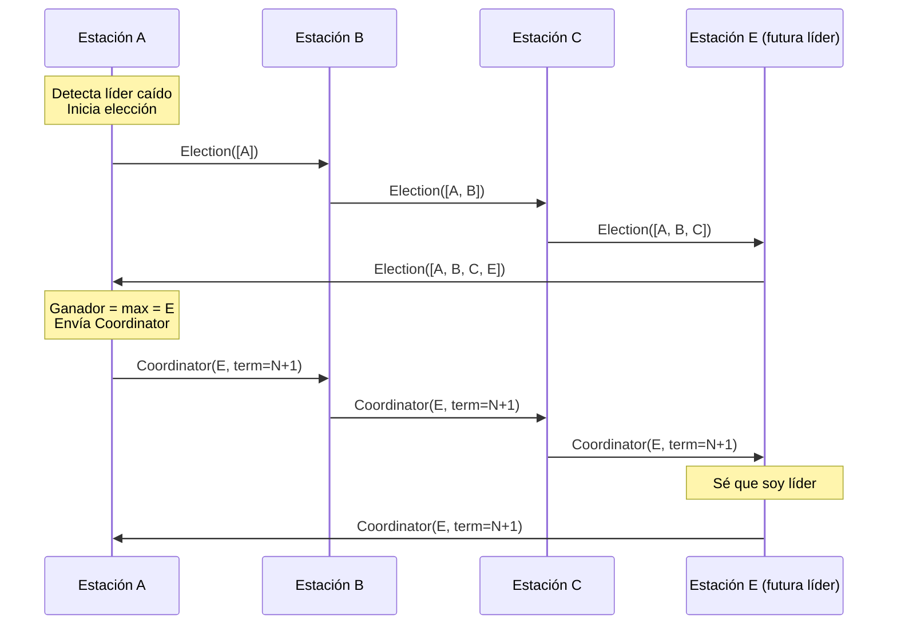

**Detalle sobre `term`:** cada elección incrementa un contador (`term`). Esto previene que un líder "viejo" que vuelve a la vida tras una caída se confunda con el líder actual: si recibe un mensaje con `term` mayor al que tiene, sabe que no es más líder y se actualiza a follower.

**Idempotencia y reintentos:** todos los mensajes al líder (eventos de alquiler, devoluciones) llevan un `event_id`. El líder mantiene un `HashSet<EventId>` de eventos ya procesados. Si recibe un duplicado, responde OK sin reprocesar. Esto permite a las estaciones reintentar indefinidamente durante elecciones sin causar inconsistencias.

---

## 8. Flujos principales (casos de uso)

### 8.1 CU1 — Alquiler exitoso

**Disparador:** El usuario se acerca físicamente a un slot ocupado con una bicicleta y le pide a su app que la alquile.

**Participantes:**

| Proceso | Actores |
|---|---|
| Usuario | (cliente simple) |
| Estación A | Estación, Slot 3, Comunicador |
| Pasarela | ProcesadorPagos, Comunicador |
| Líder (otra estación, async) | Estación en rol líder |

**Diagrama de secuencia:**

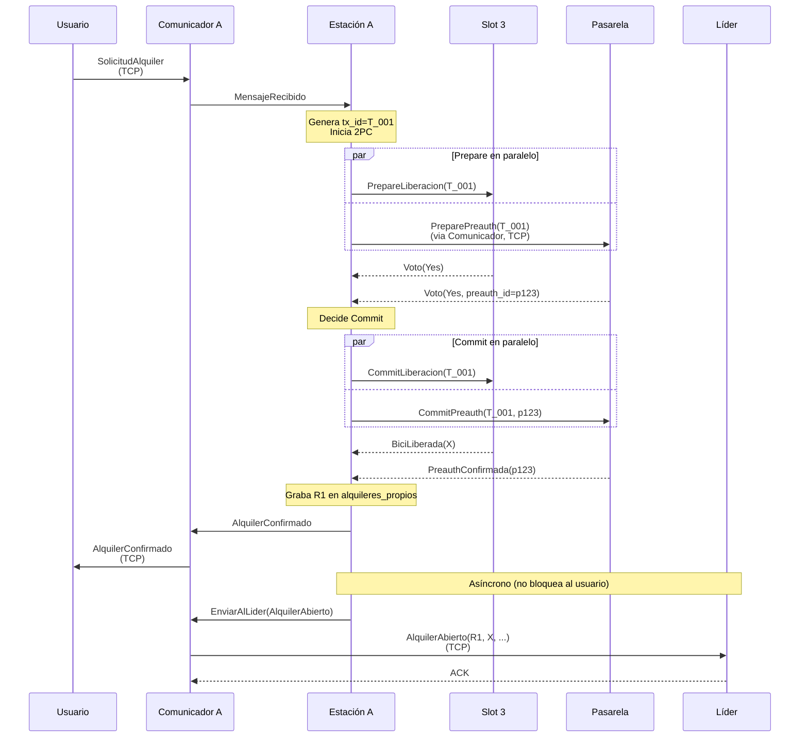

**Resultado:**
- Slot 3 vacío, bici X con el usuario.
- Preauth p123 activa en pasarela.
- R1 en `alquileres_propios` de Estación A y en el registro del líder.
- Usuario en estado `ConBici`.

**Casos de error manejados por el 2PC:**
- Slot vota `No` (slot vacío o ya reservado): aborta, usuario recibe `AlquilerRechazado`.
- Pasarela vota `No` (tarjeta inválida, sin fondos): aborta, slot libera reserva, usuario recibe `AlquilerRechazado`.
- Pasarela no alcanzable: ver Caso E (sección 7.1.1) y CU6 (sección 8.6).
- Líder caído al momento del reporte async: Comunicador encola el evento, se despacha al elegirse nuevo líder. El alquiler ya está completado para el usuario.

### 8.2 CU2 — Devolución exitosa

**Disparador:** El usuario llega a una estación distinta a la de origen, se acerca a un slot vacío, indica devolver la bici.

La estación que recibe la bici (Estación B) es quien habla con la pasarela; el líder solo le devuelve los datos del alquiler necesarios para cobrar e indica cuál fue la estación de origen. **B notifica el cierre tanto al líder (para el registro) como a la estación de origen directamente.** Así, si el líder se cae en cualquier punto posterior a `DatosParaCobro`, B igual cobra y cierra al origen, sin depender de que el líder sobreviva.

**Participantes:**

| Proceso | Rol |
|---|---|
| Usuario | Cliente |
| Estación B (destino) | Asegura la bici, consulta los datos al líder, cobra a la pasarela y notifica el cierre tanto al líder como a la estación de origen |
| Líder | Busca el alquiler en el registro y devuelve los datos de cobro (o `NoRegistradoAun`); actualiza el registro al recibir `DevolucionProcesada`. No ejecuta cobros ni propaga el cierre al origen |
| Pasarela | Calcula el monto y cobra a pedido de Estación B |
| Estación A (origen) | Recibe el `CierreAlquiler` directamente de Estación B |

**Diagrama de secuencia:**

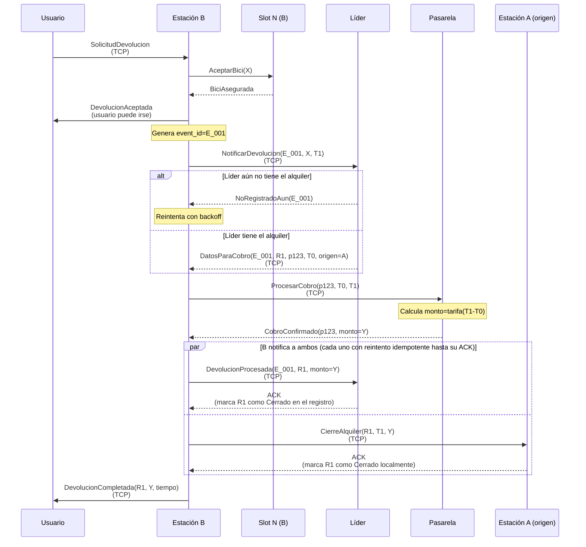

**Resultado:**
- Slot N de Estación B ocupado con bici X.
- Preauth p123 cobrada (monto Y).
- R1 cerrado en registro del líder y en `alquileres_propios` de Estación A.
- Usuario en estado `SinBici`, ve confirmación de cobro.

**Por qué esto cierra la ventana de falla.** Una vez que B recibió `DatosParaCobro`, tiene todo lo necesario (`preauth_id`, `T0`, `estacion_origen`) para terminar la devolución por su cuenta. Si el líder se cae después de ese punto, B igual cobra a la pasarela, igual le manda `CierreAlquiler` directo al origen (reintentando hasta el ACK), e igual reintenta `DevolucionProcesada` contra el líder cuando vuelva (o contra el nuevo líder electo). La estación de origen queda cerrada sí o sí, sin depender de la supervivencia del líder. Ambas notificaciones son idempotentes (por `rental_id` / `event_id`), así que los reintentos son seguros.

**Manejo de errores:**

| Falla | Recuperación |
|---|---|
| Líder caído al notificar devolución | Comunicador de B encola y reintenta. Si hubo re-elección, el nuevo líder responde (o `NoRegistradoAun` hasta terminar la reconstrucción del registro). El flujo continúa. |
| Líder se cae tras dar `DatosParaCobro` | B ya tiene todo lo necesario: cobra a la pasarela, manda `CierreAlquiler` directo a A, y reintenta `DevolucionProcesada` contra el líder (o el nuevo) hasta el ACK. A queda cerrado sin depender del líder. |
| Pasarela caída en `ProcesarCobro` | Estación B reintenta con backoff. La preauth es idempotente: si ya estaba cobrada, la pasarela devuelve el monto previo. |
| Estación B se cae entre `DatosParaCobro` y `ProcesarCobro` | Al reiniciar, B reenvía `NotificarDevolucion` con el mismo `event_id`. El líder responde de nuevo con `DatosParaCobro` y el flujo retoma. |
| Estación origen A caída al recibir el cierre | B reintenta `CierreAlquiler` hasta el ACK (asunción: las estaciones siempre vuelven eventualmente). |
| Alquiler no registrado en el líder (alquiler offline aún no regularizado, o reconstrucción incompleta) | Líder responde `NoRegistradoAun`; B reintenta. Si nunca aparece → bici huérfana (sección 8.2.1). |

#### 8.2.1 — Manejo de bicis huérfanas

Una bici se considera **huérfana** cuando llega físicamente a un slot pero el líder no encuentra un alquiler abierto asociado a esa `bici_id` en su registro. Esto puede ocurrir por dos motivos:
- El evento `AlquilerAbierto` original nunca llegó al líder (se perdió durante una caída prolongada, o la estación origen lo persistió pero el reporte async quedó en cola).
- Hubo un cambio de líder reciente y la reconstrucción del registro está incompleta (alguna estación no respondió a `SolicitarAlquileresAbiertos` durante la elección).

**Resultado posible 1 — recuperación automática:** alguna estación tenía el alquiler en sus `alquileres_propios` pero no se había reportado al líder. El líder lo reincorpora al registro y el flujo de devolución continúa normalmente.
**Resultado posible 2 — huérfana confirmada:** ninguna estación reconoce el alquiler. La bici queda asegurada en el slot pero no se cobra (no hay pre-autorización asociada). Se registra en el log de la estación destino para auditoría. La bici está disponible para nuevos alquileres a partir de ese momento.

Este protocolo asegura que el sistema converge a un estado consistente para cualquier bici que llegue a un slot, independientemente de qué eventos se hayan perdido en el camino, sin requerir intervención manual del operador.

### 8.3 CU3 — Consulta de disponibilidad

**Disparador:** El usuario abre la app y solicita ver las estaciones cercanas con bicis y slots disponibles.

El usuario descubre al líder preguntándole a cualquier estación de su config, y después le consulta directo. El líder responde con datos de su cache de estados, que se alimenta de los snapshots `EstadoEstacion` que cada estación envía por UDP.

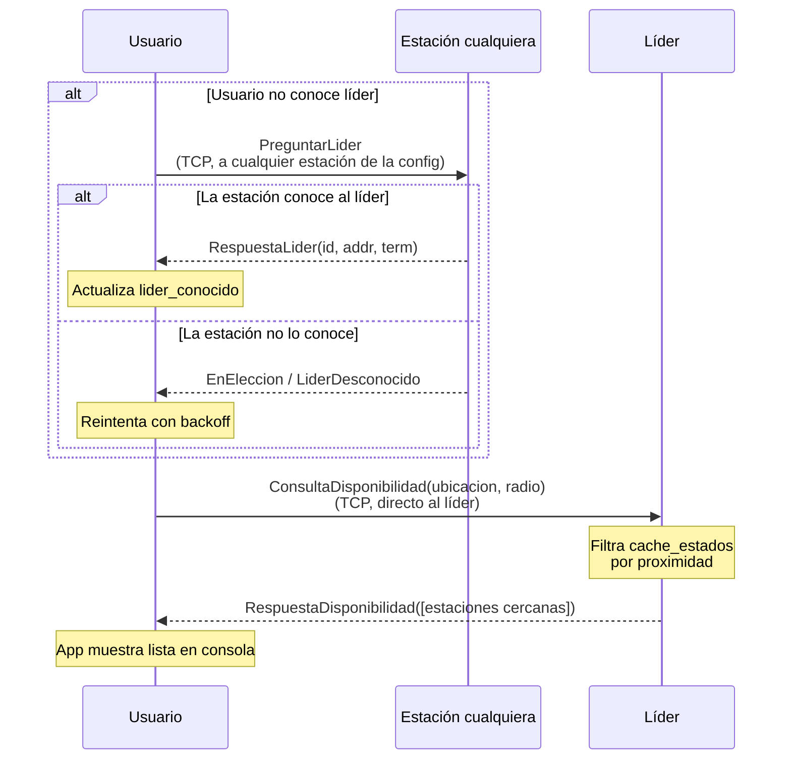

**Resultado:** el usuario ve la lista de estaciones cercanas con sus bicis y slots libres en el momento de la consulta (data con latencia de hasta ~3 segundos, por el ciclo periódico de UDP entre estaciones y líder).

**Casos de error:**

| Falla | Recuperación |
|---|---|
| Usuario no conoce líder | Pregunta a cualquier estación. Si está en elección, recibe `EnEleccion`/`LiderDesconocido` y reintenta. |
| Líder no responde (timeout) | El usuario descarta su referencia (`lider_conocido = None`) y repite el discovery. |
| Cache del líder tiene info muy vieja sobre una estación | Líder excluye esa estación de la respuesta o la marca como "stale". |
| Usuario en modo `SoloLocal` | No puede consultar disponibilidad global (requiere al líder); sí puede alquilar y devolver localmente. |

### 8.4 CU4 — Caída del líder y reconstrucción del registro

**Disparador:** Una estación detecta que el líder actual no responde (timeout en intentos previos).

**Diagrama de secuencia:**

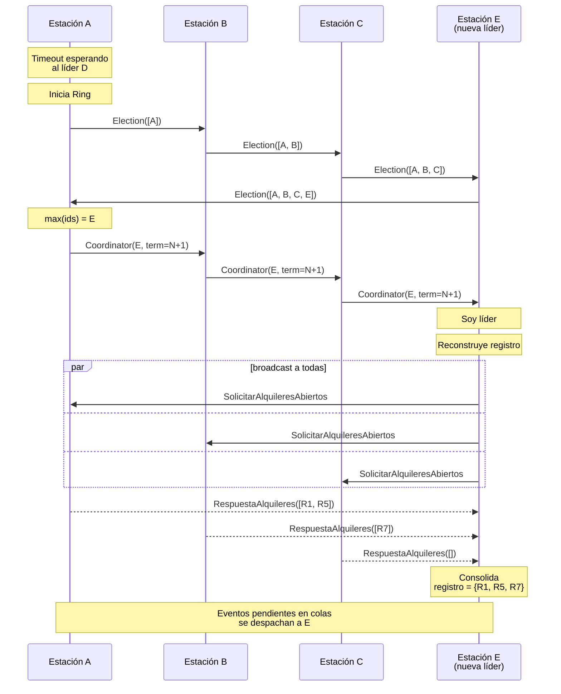

**Resultado:**
- E es el nuevo líder reconocido por todas las estaciones.
- El registro de alquileres está reconstruido a partir de los `alquileres_propios` de cada estación.
- Los eventos en colas de los Comunicadores se despachan al nuevo líder.
- La transición típicamente dura unos pocos segundos. Durante ese tiempo, las operaciones locales siguen funcionando; solo las que requieren al líder se encolan. Los usuarios que consultan reciben `EnEleccion`/`LiderDesconocido` y reintentan.

**Casos edge:**

| Caso | Manejo |
|---|---|
| Dos estaciones detectan caída simultáneamente | Ambas inician elección. Los dos mensajes Election circulan en paralelo. Ambos calculan el mismo ganador. Los `Coordinator` con mismo `term` son idempotentes. |
| Una estación está caída durante la elección | El mensaje Election la saltea (timeout + skip). Cuando vuelve, sincroniza el `term` y se reincorpora. |
| El "ex-líder" D vuelve | Recibe Coordinator con `term` mayor. Se actualiza como follower. |
| Una estación está caída durante la reconstrucción | E timeoutea, continúa con datos parciales. Cuando la estación vuelve, envía `IngresoTardio` y el líder consolida. |

### 8.5 CU5 — Alquiler con usuario sin conectividad global

**Disparador:** Un usuario en modo `SoloLocal` (sin señal celular hacia la red global, pero con acceso a una estación físicamente cercana) quiere alquilar.

El usuario puede igualmente alquilar y devolver conectándose directamente a la estación cercana por TCP. El flujo dentro de la estación es idéntico al normal: la estación procesa el alquiler según **su propia** conectividad (CU1 si alcanza la pasarela, o Caso E si no). Lo único que el usuario no puede hacer en `SoloLocal` es consultar disponibilidad global.

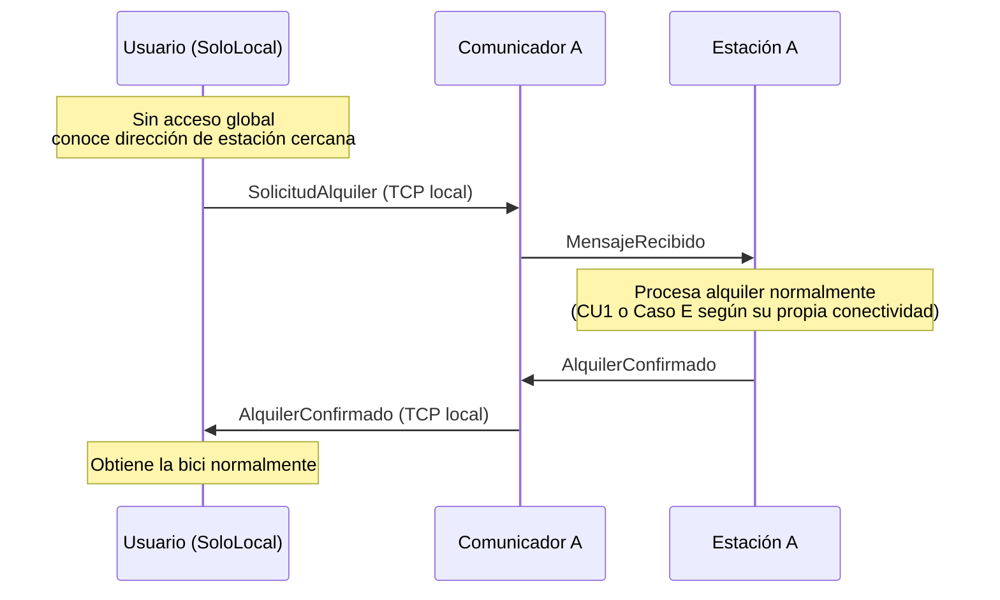

### 8.6 CU6 — Alquiler offline (estación sin pasarela) y posterior reconexión

**Disparador:** Una estación recibe una `SolicitudAlquiler` pero su `Comunicador` reporta que la pasarela no es alcanzable.

Resuelve el alquiler solo con el `Slot` (Caso E de la sección 7.1.1), entrega la bici, persiste un `PagoPendiente` y **no** reporta al líder. Cuando recupera el acceso a la pasarela, regulariza: obtiene la preauth y recién entonces reporta el alquiler al líder. El cobro sucede después, al devolverse la bici (CU2).

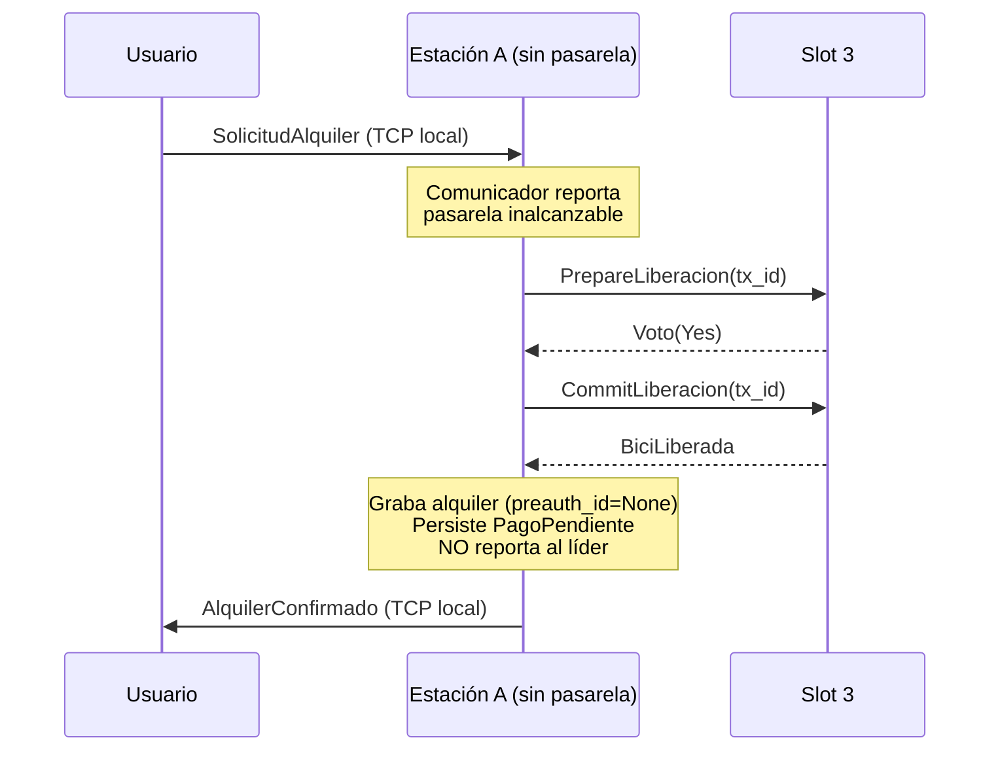

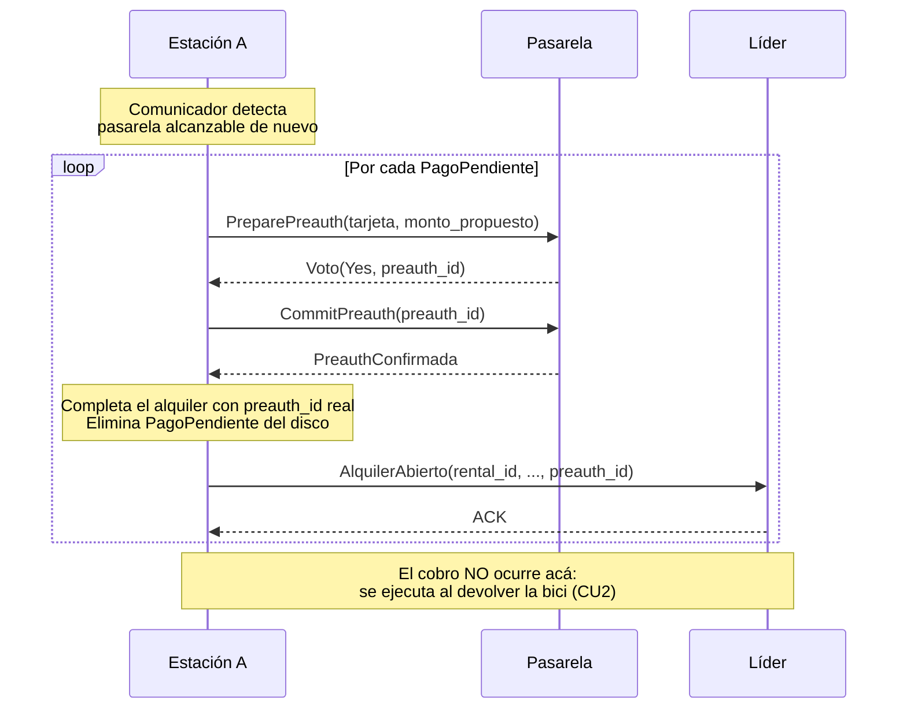

La regularización solo se ocupa de obtener la preauth y reportar al líder. El cobro y el cierre suceden por el flujo normal de devolución, así que no hay que tratar el caso de un `t1` todavía desconocido.

---

## 9. Estructura del proyecto

```
tp-concurrentes/
├── Cargo.toml                       (workspace root)
├── README.md                        (este archivo)
├── PLAN.md                          (plan de trabajo)
├── PLAN_DESARROLLO.md               (etapas de desarrollo y criterios de aceptación)
├── comun/                           (crate library: tipos compartidos + red)
│   ├── Cargo.toml
│   └── src/
│       ├── lib.rs
│       ├── ids.rs                   (EstacionId, RentalId, BiciId, EventId, DatosTarjeta, ...)
│       ├── tiempo.rs                (Timestamp)
│       ├── dominio.rs               (Alquiler, EstadoAlquiler, InfoEstacion)
│       ├── config.rs               (parsing de estaciones.json)
│       ├── args.rs                 (parsing de argumentos CLI)
│       ├── framing.rs              (framing length-prefix para TCP)
│       ├── comunicador.rs          (actor Comunicador: TCP/UDP, compartido)
│       ├── mensajes/
│       │   ├── mod.rs
│       │   ├── usuario_estacion.rs  (operaciones + consulta/discovery + envelope MensajeUsuario)
│       │   ├── estacion_estacion.rs
│       │   └── estacion_pasarela.rs
│       └── serializacion.rs
├── estacion/                        (crate binary)
│   ├── Cargo.toml
│   └── src/
│       ├── main.rs
│       ├── estacion.rs              (actor Estacion)
│       ├── slot.rs                  (actor Slot)
│       ├── pago_pendiente.rs        (PagoPendiente)
│       ├── ring.rs                  (lógica del algoritmo de elección)
│       ├── dos_fases.rs             (helpers del 2PC)
│       └── persistencia.rs          (serialización a JSON)
├── pasarela/                        (crate binary)
│   ├── Cargo.toml
│   └── src/
│       ├── main.rs
│       ├── procesador_pagos.rs      (actor ProcesadorPagos)
│       ├── tarifa.rs                (cálculo del monto)
│       └── persistencia.rs
└── usuario/                         (crate binary)
    ├── Cargo.toml
    └── src/
        ├── main.rs
        ├── usuario.rs
        └── repl.rs                  (lectura de comandos por consola)
```

Cada `struct` y cada tipo de actor en su propio archivo fuente, según el requerimiento del enunciado.

---

## 10. Cómo ejecutar el sistema

**Nota:** la implementación está en curso. Las instrucciones definitivas se actualizarán para la entrega final.

Esquema preliminar:

```bash
# Compilar todo el workspace
cargo build --release

# Lanzar el sistema de pagos
cargo run --release --bin pasarela -- --puerto 9000 --config estaciones.json

# Lanzar estaciones (en terminales separadas)
cargo run --release --bin estacion -- --id 1 --puerto 8001 --config estaciones.json
cargo run --release --bin estacion -- --id 2 --puerto 8002 --config estaciones.json
cargo run --release --bin estacion -- --id 3 --puerto 8003 --config estaciones.json

# Lanzar usuarios (en terminales separadas)
cargo run --release --bin usuario -- --id alice --config estaciones.json
cargo run --release --bin usuario -- --id bob --config estaciones.json
```

Cada proceso lee input por consola para simular las acciones (acercarse a un slot, perder/recuperar conectividad, etc.) y escribe el output del sistema también por consola. El `usuario` arranca con el mismo `estaciones.toml` para conocer las direcciones de las estaciones y poder descubrir al líder.

### Archivo de configuración de topología (ejemplo)

```json
{
  "estaciones": [
    { "id": 1, "puerto": 8001, "ubicacion": [-34.6037, -58.3816] },
    { "id": 2, "puerto": 8002, "ubicacion": [-34.6100, -58.3850] },
    { "id": 3, "puerto": 8003, "ubicacion": [-34.6200, -58.3900] }
  ],
  "pasarela": { "puerto": 9000 },
  "tarifa": { "base": 50.0, "por_minuto": 10.0 },
  "lider": 1
}
```

Usamos JSON (no TOML) para no depender de una crate extra de parsing, respetando la restricción de dependencias del enunciado. El campo `lider` designa la estación que arranca como líder (en la Etapa de elección esto pasa a decidirlo el algoritmo Ring). El mismo archivo lo usan los tres binarios: la estación toma su entrada por `--id`, la pasarela usa `pasarela` y `tarifa`, y el usuario usa la lista de estaciones para descubrir al líder.

---

## 11. Decisiones de diseño

A continuación se resumen las decisiones tomadas durante el diseño, con su justificación.

**Slots como actores participantes del 2PC.** Cada slot es un actor independiente con su propia mailbox. Modelarlo como actor (en lugar de como un campo `struct` adentro de `Estacion`) responde a tres motivos concretos:
1. **Estado tentativo durante el Prepare:** En la fase Prepare del 2PC, el slot debe reservar la bici sin liberarla todavía. Este estado intermedio "reservado pero no liberado" tiene que ser atómico respecto a otras operaciones concurrentes sobre el mismo slot.
2. **Voto significativo:** El slot vota `No` legítimamente si está vacío, si la bici no es la esperada, o si ya está reservado para otra transacción. No es un participante "decorativo": tiene reglas locales que puede rechazar.
3. **Aislamiento de fallas:** Si en el futuro un slot necesita lógica más compleja (timeout de reserva, recuperación tras crash, sensores adicionales), está aislada del resto de la estación.

**Comunicador separado de Estación y Pasarela.** Aísla la lógica de red (conexiones, reintentos, encolado por desconexión, registro de servicios alcanzables) del actor de negocio. Permite testear la lógica sin red y centraliza el manejo de fallas de conectividad en un único lugar. Esta separación es justamente la que hace que la conectividad de la estación sea responsabilidad del `Comunicador` (vía `ServiciosAlcanzables`) y no un flag del actor de negocio.

**Eliminación de un gateway centralizado de consultas.** El usuario habla directamente con las estaciones para todo, incluida la consulta de disponibilidad. Un proceso gateway dedicado solo a reenviar consultas al líder sería un punto único de falla sin lógica propia: si cae, ningún usuario podría consultar disponibilidad aunque todas las estaciones funcionaran. En cambio, el usuario descubre al líder preguntando a cualquier estación de su config (`PreguntarLider`) y, una vez que lo conoce, le consulta directo.

**2PC en el flujo de alquiler, no en la devolución.** En el alquiler, el "abort" tiene un significado claro: no se libera la bici. En la devolución, la bici se acepta físicamente siempre (no se puede "rechazar" una vez que está en el slot), por lo que el patrón natural es secuencial con reintentos idempotentes, no 2PC.

**La estación destino cobra en la devolución, no el líder.** El líder no debería tener lógica de pagos; eso es dominio de las estaciones que hablan con la pasarela. Además, sacar al líder del camino crítico del cierre cierra una ventana de falla: una vez que la estación destino recibió `DatosParaCobro`, cobra y notifica el cierre al origen por su cuenta (reintentando hasta el ACK), sin depender de que el líder sobreviva.

**Líder elegido por algoritmo Ring.** Se elige Ring sobre Bully porque su mensaje `Election` viaja secuencialmente por el anillo, lo que facilita rastrear el estado "en elección" — cada nodo que ya forwardeó el mensaje conoce el estado.

**Costo y escalabilidad.** En Ring, una elección requiere `2N` mensajes (una vuelta de `Election` más una de `Coordinator`), donde `N` es el número de estaciones. Para las topologías que probaremos en el TP (entre 3 y 5 estaciones), el volumen es bajo y aceptable. Para una red urbana grande con decenas de estaciones, el costo crecería linealmente y la latencia sería notable, dado que el algoritmo es secuencial.

**Mitigación a futuro.** Una topología más escalable agruparía las estaciones por zonas geográficas y elegiría un líder por zona, comunicando solo a los líderes entre sí. Está fuera del alcance del TP, pero encaja con el requerimiento de minimizar tráfico comunicándose solo con nodos cercanos.

**Pasarela centralizada (single instance).** El enunciado no exige una pasarela distribuida. Una pasarela única simula realísticamente al banco/procesador externo, simplifica el diseño y no compromete los requerimientos. La replicación se menciona como mejora futura.

**Tarifa calculada en la pasarela.** Las estaciones y el líder solo manejan timestamps. La pasarela tiene la lógica de tarifas (base + por_minuto). Esto desacopla: cambios de precios no afectan al resto del sistema.

**El registro de alquileres es source of truth en el líder, pero cada estación tiene su propia copia local de sus alquileres propios.** Esto permite reconstruir el registro consultando a las estaciones cuando se elige un nuevo líder. La fuente última de cada alquiler es la estación que lo originó.

**Idempotencia generalizada vía IDs únicos.** Cada mensaje crítico al líder lleva un `event_id`; cada alquiler tiene un `rental_id`; cada pago tiene un `preauth_id`. Los actores mantienen los conjuntos de IDs ya procesados para responder idempotente a reintentos. Esto permite reintentos seguros durante elecciones y caídas parciales.

**Reporte al líder asíncrono, y nunca sin preauth.** Tras un alquiler exitoso, el reporte al líder se hace en background (el Comunicador encola si el líder no está disponible). El usuario no espera por esto. Además, ningún alquiler se reporta al líder sin pre-autorización: en modo offline el reporte se difiere hasta obtener la preauth, de modo que el registro del líder solo contiene alquileres con `preauth_id` válido.

**Funcionamiento desconectado.** El usuario puede quedar en modo `SoloLocal` (solo alcanza estaciones cercanas) y aun así alquilar/devolver. La estación, por su parte, puede no alcanzar a la pasarela: en ese caso resuelve el alquiler solo con el `Slot` (Caso E), prioriza la disponibilidad sobre la atomicidad estricta, y regulariza cuando recupera la conectividad.

**TCP para crítico, UDP para estado periódico.** TCP donde no se puede perder un mensaje (alquileres, devoluciones, pagos, Ring de elección). UDP solo para el estado agregado periódico de cada estación al líder, que se renueva con frecuencia y donde una pérdida individual es tolerable.

**Conocimiento de la topología por configuración estática.** Cada estación (y cada usuario) arranca con un archivo de config que lista todas las estaciones (id, dirección, ubicación). El anillo se construye por orden de `EstacionId`. El descubrimiento dinámico se deja como mejora futura.

**Persistencia mínima en archivos JSON.** Cumple el requerimiento de no usar base de datos ni GUI. Cada actor con estado importante (Estacion, ProcesadorPagos) serializa periódicamente y al cambiar estados críticos. Al reiniciar, lee del archivo y reanuda.

**Estados de usuario y alquiler como `enum`.** Modelar los estados como `enum` con variantes con datos asociados impide construir estados inválidos por construcción (por ejemplo, un usuario no puede "consultar bici" si está en variante `SinBici`).
